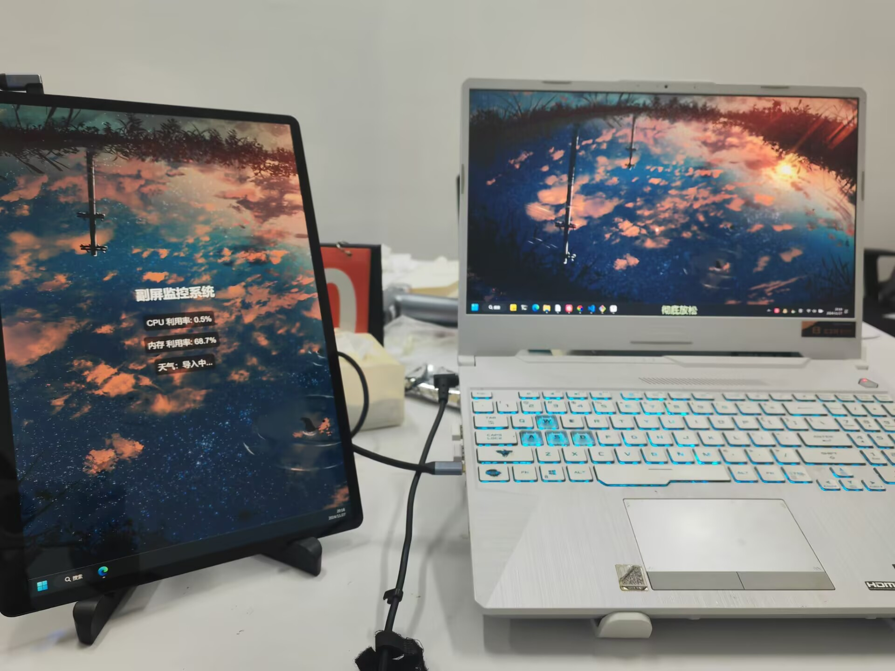

### 
一个基于网页的副屏监控壁纸

## 项目功能：

​	基于壁纸引擎Lively Wallpaper实现在副屏上显示监控信息的动态壁纸软件，初步设想的功能包括：查看天气状况，查看本地cpu、内存占用情况等电脑实时信息，添加删除代表事项，今日大事件新闻热搜速览。

前端，采用html+css+js进行画面的渲染

后端，采用python的flask搭建小型服务器用于对本机实时信息的传递

通过Lively Wallpaper或者Wallpaper engine等壁纸软件，在副屏中动态壁纸处写上服务器的本地ip地址即可

展示如下；

